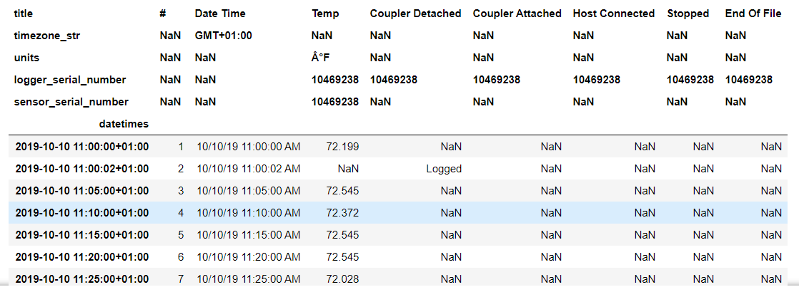

# hoboreader
Python package for reading Onset Hobo sensor csv files

## To install:

`pip install hoboreader`

## Quick demo:

The following code reads a Hobo csv file and converts it to a pandas DataFrame:

```Python
from hoboreader import HoboReader
h=HoboReader('sample_hobo_data.csv')
df=h.get_dataframe()
```

The DataFrame looks like this:



## User Guide

### Importing the HoboReader class:

```python
from hoboreader import HoboReader
```

### Creating an instance of HoboReader and reading in a Hobo data csv file:

Either:

```python
h=HoboReader()
h.read_csv('sample_hobo_data.csv')
```

or:

```python
h=HoboReader('sample_hobo_data.csv')
```

### Working with attributes

As the csv file is read in, a number of attributes are populated. These are:

``` python
h.reader # a Python csv.reader object
h.header_row # a list of the header row of the csv file
h.header_list # a list of dictionaries with the header row information
h.hobo_timezone_str # a string of the timezone as expressed in the header row
h.timezone # a Python datetime.timezone instance
h.data_rows # a list of each row of the timeseries measured data
h.data_columns # a list of each column of the timeseries measured data
h.datetimes # a list of the timestamps converted to Python datetime.datetime instances 
```

See the [attributes_demo.ipynb](https://github.com/stevenkfirth/hoboreader/blob/master/demo/attributes_demo.ipynb) Jupyter Notebook in the 'demo' section for more on these attributes.

### Creating a Pandas DataFrame

A Pandas DataFrame can be created using:

``` python
df=h.get_dataframe()
```

See the [dataframe_demo.ipynb](https://github.com/stevenkfirth/hoboreader/blob/master/demo/dataframe_demo.ipynb) Jupyter Notebook in the 'demo' section for how to work with this dataframe.

### Creating rdf data

The Hobo data can be converted to rdf data and added to an existing rdflib graph:

``` python
import rdflib
g=rdflib.Graph()
g=h.add_rdf(g)
```

See the [rdf_demo.ipynb](https://github.com/stevenkfirth/hoboreader/blob/master/demo/rdf_demo.ipynb) Jupyter Notebook in the 'demo' section for how to work with this dataframe.


